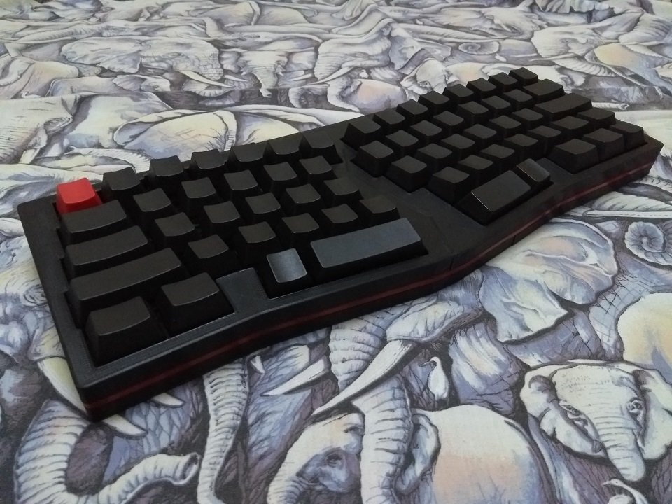
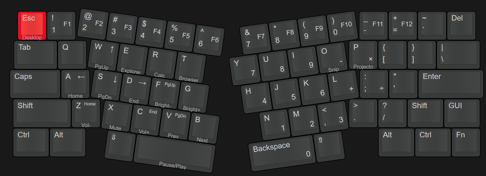
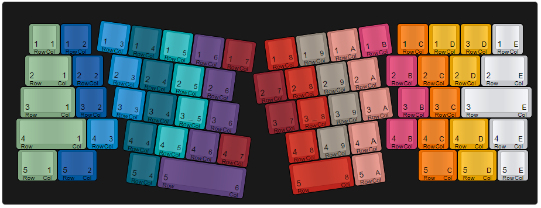

# "fAuxLICE"

An 3D printable Alice-like mechanical keyboard

## Layout

[Keyboard Layout Editor](http://www.keyboard-layout-editor.com/#/gists/7f17a55de07d88c1f975089b07f053b1)

## Components

### Required components

- 64× switches of your choice
- 4× plate-mounted Costar stabilizers
- 108-key keycap set
- 64× diodes
- Wires
- 14× M3×16 countersunk screws
- 2× M3×12 countersunk screws

### Optional components

- 1x M3×8 countersunk screw
- 1x M3×10 countersunk screw
- 1x M3×12 countersunk screw
- 1× M3×16 countersunk screw
- 1× M3×20 countersunk screw

The optional components are for reinforcing the top halves. They're not required. A proper glue up would be probably enough for the two halves.

## Wiring diagram

The keyboard is wired in a 5-row, 14-column configuration. Sorry for starting my row/column index at 1!

## Build notes

The accent pieces have an extra 5mm sticking out. You should be able to cut them to the perfect length, and make the transitions between the two seamless. Glue the accent pieces to the bottom halves.

The halves do not lock into each other. I used a combination of glue and diode trimmings melted into the plastic.

I used a knife tip on my soldering iron and set the temperature to 250°C. Place the diode lead trimming on the plastic and melt it. I did this only on the inside surfaces so it wouldn't matter if it's ugly. I then supplemented it by melting loose filament into place.

## Firmware

The firmware included is for the STM32F103 ["Blue Pill"](https://wiki.stm32duino.com/index.php?title=Blue_Pill) board.

The STM32duino bootloader is not necessary. Simply flash the board using an ST-Link programmer.

## More info

More info can be found in [this blog post](https://ramonimbao.github.io/alice-like-keyboard/).

## License

This project is licensed under the MIT license. See the `LICENSE.md` for more details.